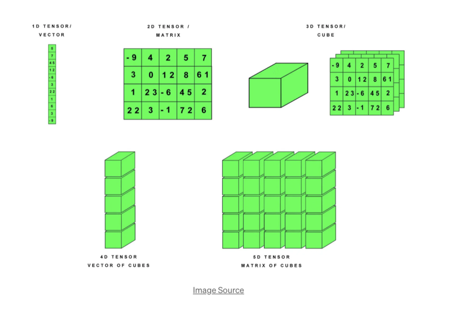
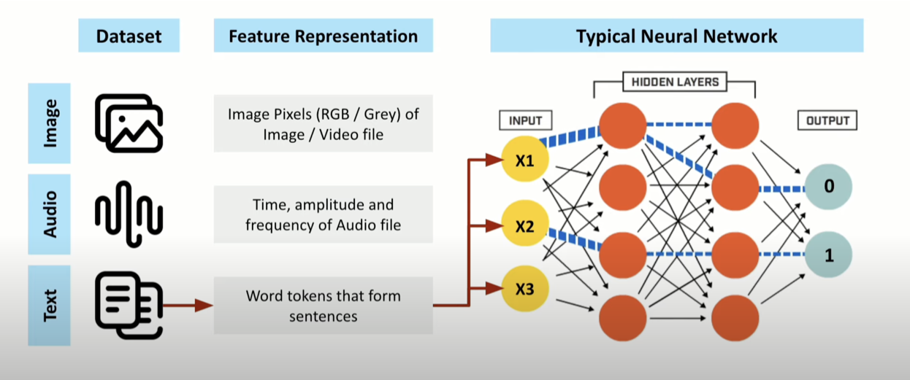
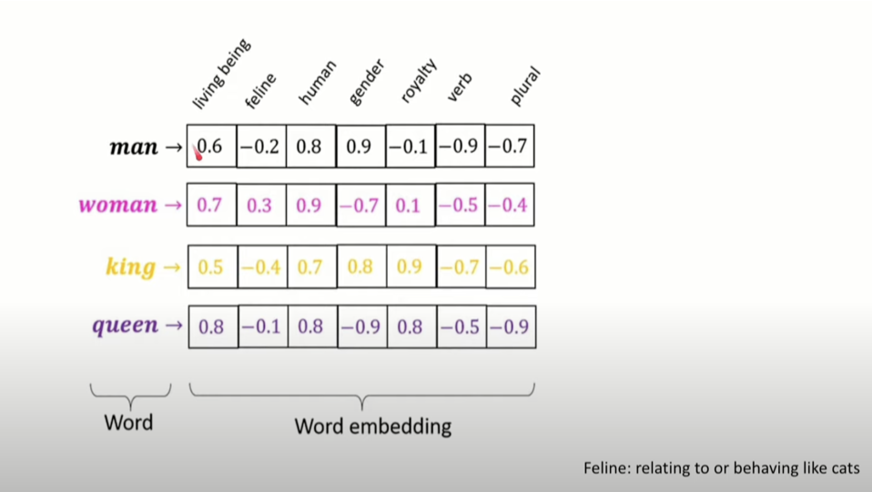
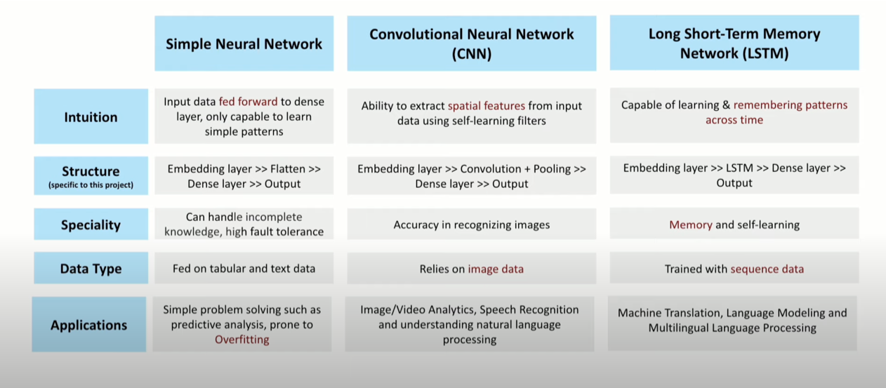

# Neural Network (TensorFlow) - Sentiment Analysis
## High-Level Landscape


## Data Input & Output Data Types


## Model Building Process Flow
### Input (Data Processing) -> Processing (Training) -> Output (Prediction/Inference)


## Text Data Input Transformation
### Tokenization (Split Words > Convert into unique numeric value)

### Embedding (Creates Word Semantic Relation based on weights)


## Neural Network Types


### Simple Neural Network
```
snn_model = Sequential()
embedding_layer = Embedding(vocab_length, 100, weights=[embedding_matrix], input_length=maxlen , trainable=False)

snn_model.add(embedding_layer)

snn_model.add(Flatten())
snn_model.add(Dense(1, activation='sigmoid'))
```

### Convolutional Neural Network
```
from keras.layers import Conv1D
```

```
cnn_model = Sequential()

embedding_layer = Embedding(vocab_length, 100, weights=[embedding_matrix], input_length=maxlen , trainable=False)
cnn_model.add(embedding_layer)

cnn_model.add(Conv1D(128, 5, activation='relu'))
cnn_model.add(GlobalMaxPooling1D())
cnn_model.add(Dense(1, activation='sigmoid'))
```

### Recurrent Neural Network (LSTM)
```
from keras.layers import LSTM
```

```
lstm_model = Sequential()
embedding_layer = Embedding(vocab_length, 100, weights=[embedding_matrix], input_length=maxlen , trainable=False)

lstm_model.add(embedding_layer)
lstm_model.add(LSTM(128))

lstm_model.add(Dense(1, activation='sigmoid'))
```

References: [Guide1](https://medium.com/@email2sukrit/finer-grain-sentiment-analyzer-a-tensorflow-keras-project-1e1cce86d9d7), [Guide2](https://drlee.io/build-an-nlp-model-for-sentiment-analysis-using-tensorflow-in-10-minutes-a6d3de84b17f), [Guide3](https://medium.com/@kwasiasomani85/movie-review-sentimental-classification-with-recurrent-neural-network-in-tensorflow-3c0ce1c1fea6), [Tokenizers](https://huggingface.co/docs/transformers/en/fast_tokenizers)

## Customization
### Custom Embedding Layer
```
# Load GloVe word embeddings and create an Embeddings Dictionary

from numpy import asarray
from numpy import zeros
```

```
embeddings_dictionary = dict()
glove_file = open('a2_glove.6B.100d.txt', encoding="utf8")

for line in glove_file:
    records = line.split()
    word = records[0]
    vector_dimensions = asarray(records[1:], dtype='float32')
    embeddings_dictionary [word] = vector_dimensions
glove_file.close()
```

```
# Create Embedding Matrix having 100 columns 
# Containing 100-dimensional GloVe word embeddings for all words in our corpus.

embedding_matrix = zeros((vocab_length, 100))
for word, index in word_tokenizer.word_index.items():
    embedding_vector = embeddings_dictionary.get(word)
    if embedding_vector is not None:
        embedding_matrix[index] = embedding_vector
```
Ref: [Glove Word Vectors](https://nlp.stanford.edu/projects/glove/)