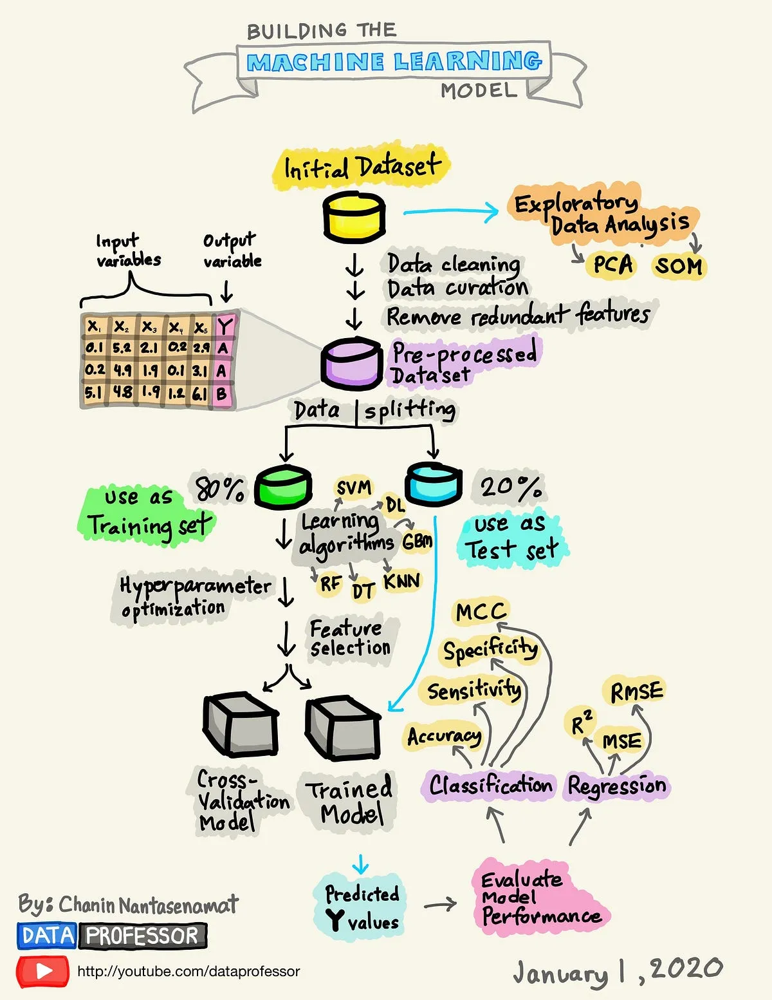

# Neural Network based on tensorflow - sentiment analysis

References: [Guide1](https://medium.com/@email2sukrit/finer-grain-sentiment-analyzer-a-tensorflow-keras-project-1e1cce86d9d7), [Guide2](https://drlee.io/build-an-nlp-model-for-sentiment-analysis-using-tensorflow-in-10-minutes-a6d3de84b17f), [Guide3](https://medium.com/@kwasiasomani85/movie-review-sentimental-classification-with-recurrent-neural-network-in-tensorflow-3c0ce1c1fea6), [Tokenizers](https://huggingface.co/docs/transformers/en/fast_tokenizers)